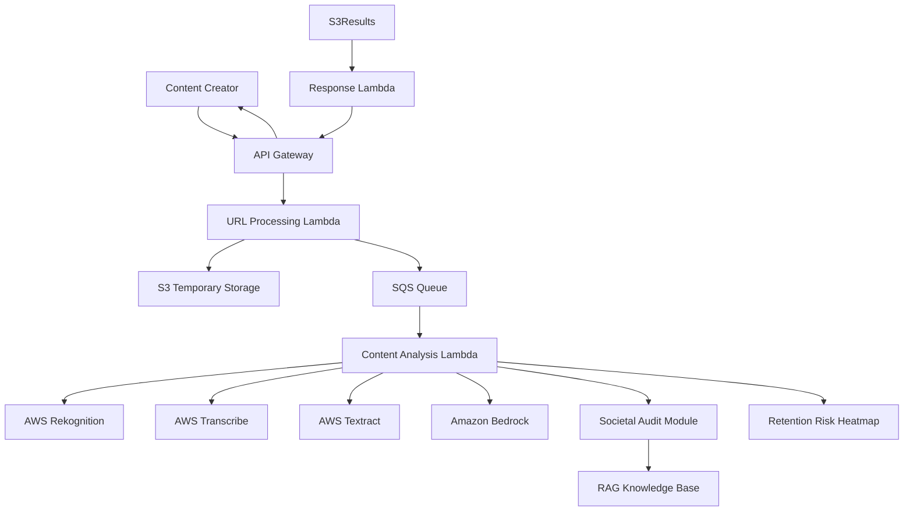

# SocialLens: Bharat-First Multimodal Content Analysis

 <!-- Note: Assuming a logo exists or can be added -->

**SocialLens** is a serverless, cloud-native platform designed to empower Indian content creators through advanced multimodal AI analysis. By leveraging the power of AWS and Amazon Bedrock, SocialLens decomposes short-form video content (Reels, Shorts) into its fundamental DNA—visual, audio, textual, and cultural—to provide actionable insights tailored to the diverse Indian demographic.

---

## 🚀 Key Features

### 🧬 DNA Vector Synthesis
Uses **Amazon Bedrock** to synthesize multimodal data into a comprehensive content profile. It captures the "essence" of your video beyond simple metrics.

### 🏛️ Societal Audit (Generational Insights)
Understand how your content resonates across different age groups in India:
- **GenZ**: Trends, slang, and fast-paced engagement.
- **Millennials**: Relatability, professional context, and nostalgia.
- **Boomers**: Values, clarity, and traditional sentiment.

### 🗣️ Hinglish & Regional Support
Specialized **Hinglish Detector** for analyzing code-switching (Hindi + English) common in Indian social media, ensuring nothing is lost in translation.

### 📊 Retention Risk Heatmap
A frame-by-frame visualization of viewer attention. Identify exactly where viewers might drop off due to pacing, motion, or emotional shifts.

### 🤖 Multimodal Engine
Powered by AWS AI Services:
- **Visual**: Object & scene detection, facial expressions (Rekognition).
- **Audio**: Speech-to-text with Indian accent support (Transcribe).
- **Text**: OCR for overlays and captions (Textract).

---

## 🏗️ Architecture

SocialLens is built with a 100% serverless, event-driven architecture for maximum scalability.



---

## 🛠️ Tech Stack

### Frontend
- **Framework**: [Next.js](https://nextjs.org/) (React 19)
- **Styling**: Tailwind CSS, Framer Motion (Animations)
- **Charts**: Recharts
- **Icons**: Lucide React

### Backend (AWS Serverless)
- **Compute**: AWS Lambda
- **Storage**: S3 (Videos/Assets), DynamoDB (Analytical Results)
- **Messaging**: SQS
- **AI/ML**: Amazon Bedrock (Claude/Llama), Rekognition, Transcribe, Textract

---

## 🚦 Getting Started

### Prerequisites
- Node.js (v18+)
- AWS Account with Bedrock access enabled

### Installation

1. Clone the repository:
   ```bash
   git clone https://github.com/IrfanHussain25/SocialLens.git
   cd SocialLens
   ```

2. Install frontend dependencies:
   ```bash
   cd frontend
   npm install
   ```

3. Configure Environment Variables:
   Create a `.env.local` in the `frontend` directory:
   ```env
   NEXT_PUBLIC_AWS_REGION=your-region
   NEXT_PUBLIC_IDENTITY_POOL_ID=your-id
   ```

4. Run the development server:
   ```bash
   npm run dev
   ```

---

## 📄 Documentation

- [Design Document](design.md) - Detailed architecture and data models.
- [Requirements](requirements.md) - Project scope and acceptance criteria.

---

## 🏆 Hackathon
Built for the **AI4Bharat Hackathon**. Optimized for Indian cultural nuances and linguistic diversity.
