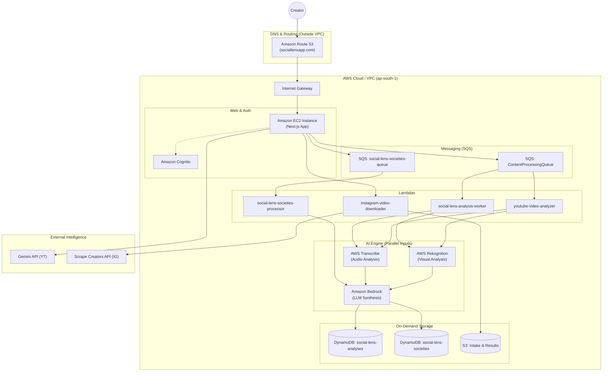

# SocialLens: AI for Content, Built for Creators


**SocialLens** is a cloud-native platform designed to empower Indian content creators through advanced multimodal AI analysis. Hosted at **[sociallensapp.com](https://sociallensapp.com)**, it decomposes short-form video content (Reels, YouTube Shorts) into its fundamental DNA—visual, audio, textual, and cultural—to provide actionable insights tailored to the diverse Indian demographic.

---

## 🚀 Key Features

### 🧬 DNA Vector Synthesis
Uses **Amazon Bedrock** to synthesize multimodal data into a comprehensive content profile. It captures the "essence" of your video beyond simple metrics, evaluating aesthetic appeal and cultural resonance.

### 🤖 Multi-Agent Societal Simulation
Our flagship feature: A simulated Indian digital society that interacts with your content before you post.
- **Societies Module**: Watch how different generational "agents" (GenZ, Millennials, Boomers) reply, share, and React to your content.
- **Generational Heatmaps**: Sentiment analysis tailored to specific Indian age cohorts.

### 🗣️ Hinglish & Regional Support
Specialized logic for analyzing **Hinglish** code-switching and Romanized Hindi text, ensuring cultural nuances and linguistic patterns common in Indian communication are accurately captured.

### 📊 Retention Risk Heatmap
A frame-by-frame visualization of viewer attention powered by **AWS Rekognition**, identifying exactly where viewers might drop off due to pacing or visual transitions.

---

## 🏗️ Architecture

SocialLens leverages a hybrid architecture combining persistent EC2 hosting with an event-driven serverless backend.



---

## 🛠️ Tech Stack

- **Frontend**: Next.js 15, Tailwind CSS, Framer Motion, Recharts.
- **Hosting**: Amazon EC2 (Next.js Node Server), Amazon Route 53.
- **Auth**: Amazon Cognito.
- **Backend**: AWS Lambda, AWS SQS.
- **AI/ML**: Amazon Bedrock (NovaPro), AWS Rekognition, AWS Transcribe.
- **External Integration**: Gemini 2.5 Flash Lite, Scrape Creators API.
- **Storage**: Amazon DynamoDB, Amazon S3.

---

## 🚦 Getting Started

### Prerequisites
- Node.js (v18+)
- AWS IAM Credentials with access to `ap-south-1` resources.

### Installation

1. Clone and install dependencies:
   ```bash
   git clone https://github.com/IrfanHussain25/SocialLens.git
   cd SocialLens/frontend
   npm install
   ```

2. Configure `.env`:
   ```env
   NEXT_PUBLIC_SL_USER_POOL_ID=...
   NEXT_PUBLIC_SL_CLIENT_ID=...
   NEXT_PUBLIC_SL_REGION=...
   NEXT_PUBLIC_SL_COGNITO_DOMAIN=...
   NEXT_PUBLIC_BASE_URL=...
   SL_ACCESS_KEY_ID=...
   SL_SECRET_ACCESS_KEY=...
   SL_SQS_QUEUE_URL=...
   SOCIETIES_SL_SQS_QUEUE_URL=...
   ```

3. Run locally:
   ```bash
   npm run dev
   ```

---

## 🏆 Hackathon
Built for the **AI For Bharat Hackathon**. SocialLens is uniquely optimized for Indian cultural nuances, Hinglish communication, and the diverse "Bharat" content ecosystem.
