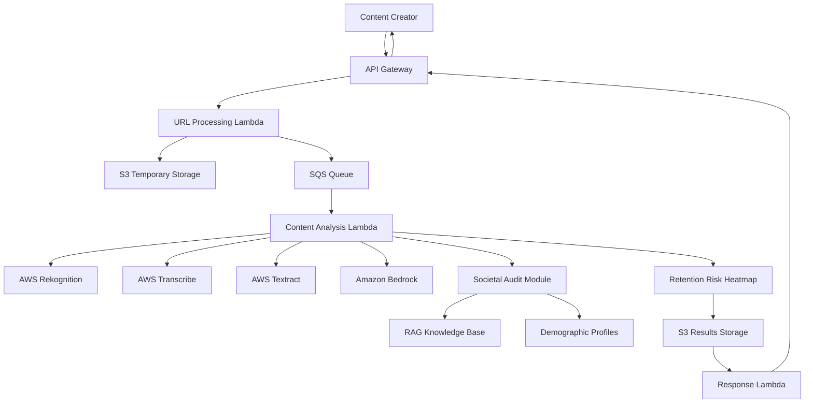

# Design Document: Social Lens

## Overview

Social Lens is a serverless, cloud-native system built on AWS that provides comprehensive multimodal analysis of short-form video content with a Bharat-First approach. The system leverages a fully serverless architecture to ensure scalability, cost-effectiveness, and low-latency processing for millions of Indian content creators.

The core innovation lies in the "DNA Vector Synthesis" approach, where content is decomposed into fundamental elements (visual, audio, textual, cultural) and synthesized into a comprehensive DNA profile that captures the essence and impact potential of the content across different Indian demographic segments.

## Architecture

### High-Level Architecture



### Serverless Components

**API Gateway**: Single entry point for all client requests, handling authentication, rate limiting, and request routing.

**Lambda Functions**: 
- URL Processing Lambda: Handles video downloading and initial preprocessing
- Content Analysis Lambda: Orchestrates multimodal analysis and DNA synthesis
- Response Lambda: Formats and delivers final analysis results

**S3 Storage**:
- Temporary bucket for raw video content (auto-deletion after 24 hours)
- Results bucket for processed analysis data and heatmaps

**SQS Queue**: Decouples URL processing from analysis for better scalability and fault tolerance.

## Components and Interfaces

### 1. URL Intake Service (API Gateway + Lambda)

**Interface**: REST API endpoint accepting POST requests with video URLs

```typescript
interface URLRequest {
  videoUrl: string;
  userId: string;
  analysisOptions?: {
    includeHinglish: boolean;
    targetDemographics: ('GenZ' | 'Millennials' | 'Boomers')[];
    culturalContext: boolean;
  };
}

interface URLResponse {
  analysisId: string;
  status: 'queued' | 'processing' | 'completed' | 'failed';
  estimatedTime: number; // seconds
}
```

**Responsibilities**:
- Validate video URLs from supported platforms (Instagram, YouTube, etc.)
- Generate unique analysis IDs
- Queue requests for processing
- Return immediate response with tracking information

### 2. Content Scraping Service (Lambda)

**Responsibilities**:
- Download video content from provided URLs
- Extract audio tracks, video frames, and text overlays
- Store raw content in S3 temporary storage
- Trigger multimodal analysis pipeline

**Implementation Details**:
- Uses headless browser automation for platform-specific scraping
- Implements retry logic with exponential backoff
- Handles rate limiting from source platforms
- Supports multiple video formats and resolutions

### 3. Multimodal Analysis Engine (Lambda + AWS AI Services)

**Visual Analysis Pipeline**:
```typescript
interface VisualAnalysis {
  objects: DetectedObject[];
  faces: FacialExpression[];
  scenes: SceneClassification[];
  culturalMarkers: CulturalElement[];
  motionData: FrameMotionVector[];
}
```

**Audio Analysis Pipeline**:
```typescript
interface AudioAnalysis {
  transcription: TranscriptionSegment[];
  hinglishDetection: CodeSwitchingEvent[];
  emotionalTone: EmotionalMarker[];
  musicGenre?: IndianMusicGenre;
  backgroundAudio: AudioClassification[];
}
```

**Text Analysis Pipeline**:
```typescript
interface TextAnalysis {
  extractedText: TextOverlay[];
  sentiment: SentimentScore;
  culturalReferences: CulturalReference[];
  languageDistribution: LanguageStats;
}
```

### 4. Amazon Bedrock DNA Vector Synthesis

**Purpose**: Combines multimodal analysis results into a comprehensive content DNA profile using large language models.

**Process**:
1. **Feature Extraction**: Convert raw analysis data into structured feature vectors
2. **Cultural Context Mapping**: Map detected elements to Indian cultural significance
3. **Demographic Relevance Scoring**: Score content relevance for each target demographic
4. **DNA Vector Generation**: Create unified representation capturing content essence

```typescript
interface ContentDNA {
  visualDNA: {
    aestheticScore: number;
    culturalRelevance: number;
    emotionalImpact: number;
    attentionGrabbing: number;
  };
  audioDNA: {
    clarityScore: number;
    hinglishBalance: number;
    emotionalResonance: number;
    culturalAuthenticity: number;
  };
  textualDNA: {
    readabilityScore: number;
    culturalSensitivity: number;
    generationalAppeal: number;
    messageClarity: number;
  };
  overallDNA: {
    viralPotential: number;
    demographicFit: DemographicScore[];
    culturalAlignment: number;
    retentionPrediction: number;
  };
}
```

### 5. Societal Audit Module (RAG Pattern)

**Architecture**: Implements Retrieval-Augmented Generation using Amazon Bedrock with custom knowledge base.

**Knowledge Base Structure**:
- **Demographic Profiles**: Detailed preferences, values, and sensitivities for GenZ, Millennials, and Boomers
- **Cultural Guidelines**: Indian cultural norms, festival contexts, regional sensitivities
- **Content Standards**: Platform-specific community guidelines and best practices
- **Trend Database**: Current viral patterns and successful content strategies

**RAG Implementation**:
```typescript
interface SocietalAudit {
  demographicAnalysis: {
    genZ: DemographicAssessment;
    millennials: DemographicAssessment;
    boomers: DemographicAssessment;
  };
  culturalSensitivity: CulturalAuditResult;
  contentRisks: RiskAssessment[];
  recommendations: DemographicRecommendation[];
}

interface DemographicAssessment {
  appropriatenessScore: number; // 0-100
  engagementPrediction: number; // 0-100
  potentialConcerns: string[];
  optimizationSuggestions: string[];
}
```

**Process Flow**:
1. **Query Construction**: Convert content DNA into semantic queries
2. **Knowledge Retrieval**: Fetch relevant demographic and cultural context
3. **Augmented Analysis**: Use retrieved context to enhance LLM analysis
4. **Risk Assessment**: Identify potential issues for each demographic
5. **Recommendation Generation**: Provide actionable insights for optimization

### 6. Retention Risk Heatmap Generator

**Purpose**: Generate frame-by-frame analysis of viewer retention risk based on motion and emotional data.

**Data Sources**:
- **Motion Vectors**: Frame-to-frame movement analysis from video processing
- **Emotional Markers**: Facial expression changes and audio emotional tone
- **Attention Patterns**: Object saliency and visual focus points
- **Pacing Analysis**: Content rhythm and transition smoothness

**Heatmap Generation Process**:
```typescript
interface RetentionHeatmap {
  frameAnalysis: FrameRetentionData[];
  riskSegments: RiskSegment[];
  overallRetentionScore: number;
  criticalMoments: CriticalMoment[];
}

interface FrameRetentionData {
  timestamp: number;
  retentionRisk: number; // 0-100 (higher = more likely to drop off)
  motionIntensity: number;
  emotionalEngagement: number;
  visualComplexity: number;
  audioEngagement: number;
}
```

**Risk Calculation Algorithm**:
1. **Motion Analysis**: Calculate frame-to-frame motion vectors and intensity
2. **Emotional Tracking**: Monitor emotional progression and consistency
3. **Attention Modeling**: Predict viewer attention based on visual elements
4. **Pacing Evaluation**: Assess content rhythm and transition quality
5. **Risk Scoring**: Combine factors into retention risk probability
6. **Heatmap Visualization**: Generate color-coded timeline visualization

## Data Models

### Core Data Structures

```typescript
// Primary analysis result
interface AnalysisResult {
  analysisId: string;
  userId: string;
  videoMetadata: VideoMetadata;
  contentDNA: ContentDNA;
  societalAudit: SocietalAudit;
  retentionHeatmap: RetentionHeatmap;
  processingTime: number;
  createdAt: Date;
}

// Video metadata
interface VideoMetadata {
  url: string;
  platform: 'instagram' | 'youtube' | 'other';
  duration: number;
  resolution: Resolution;
  fileSize: number;
  format: string;
}

// Cultural context markers
interface CulturalElement {
  type: 'festival' | 'tradition' | 'symbol' | 'language' | 'music';
  name: string;
  confidence: number;
  region?: string;
  significance: string;
  timestamp?: number;
}

// Hinglish detection results
interface CodeSwitchingEvent {
  startTime: number;
  endTime: number;
  hindiText: string;
  englishText: string;
  switchType: 'intra-sentential' | 'inter-sentential' | 'tag-switching';
  naturalness: number; // 0-100
}
```

### Storage Schema

**DynamoDB Tables**:
- **AnalysisResults**: Primary table for completed analyses (partitioned by userId)
- **DemographicProfiles**: Cached demographic preference data
- **CulturalKnowledge**: Cultural context and significance mappings
- **ProcessingQueue**: Active analysis tracking and status updates

**S3 Bucket Structure**:
```
reel-dna-temp/
  ├── raw-videos/{analysisId}/
  │   ├── video.mp4
  │   ├── audio.wav
  │   └── frames/
reel-dna-results/
  ├── analyses/{userId}/{analysisId}/
  │   ├── dna-profile.json
  │   ├── heatmap.png
  │   └── detailed-report.json
```

## Correctness Properties

*A property is a characteristic or behavior that should hold true across all valid executions of a system—essentially, a formal statement about what the system should do. Properties serve as the bridge between human-readable specifications and machine-verifiable correctness guarantees.*

### Property 1: Content Ingestion Completeness
*For any* valid video URL submitted to the system, the Content_Ingestion_Service should successfully download the content, extract all three modalities (audio, visual frames, text overlays), and trigger the multimodal analysis pipeline.
**Validates: Requirements 1.1, 1.3, 1.4**

### Property 2: Error Handling Timeliness  
*For any* invalid or inaccessible URL submitted to the system, the Content_Ingestion_Service should return a descriptive error message within 5 seconds.
**Validates: Requirements 1.2**

### Property 3: Platform URL Support
*For any* URL from supported platforms (Instagram Reels, YouTube Shorts, major Indian platforms), the Content_Ingestion_Service should correctly process and analyze the content.
**Validates: Requirements 1.5**

### Property 4: Multimodal Analysis Completeness
*For any* video content processed by the system, the Multimodal_Analysis_Engine should perform visual analysis (object detection, scene analysis, facial expressions), audio transcription with Indian language support, text extraction when overlays exist, and combine all insights into a unified report.
**Validates: Requirements 2.1, 2.2, 2.3, 2.4**

### Property 5: Cultural Context Recognition
*For any* content containing Indian cultural elements (festivals, traditions, symbols, music, accents), the Multimodal_Analysis_Engine should identify and provide context-aware analysis including cultural significance and regional variations.
**Validates: Requirements 2.5, 7.1, 7.2, 7.3, 7.4, 7.5**

### Property 6: Comprehensive Generational Analysis
*For any* content analysis performed, the Societal_Sentiment_Filter should evaluate sentiment appropriateness for all three demographic groups (GenZ, Millennials, Boomers) and provide specific recommendations for each group.
**Validates: Requirements 3.1, 3.2, 3.3, 3.4**

### Property 7: Cultural Sensitivity Flagging
*For any* content that contains culturally insensitive or inappropriate material for specific generational cohorts, the Societal_Sentiment_Filter should flag the content with appropriate warnings.
**Validates: Requirements 3.5**

### Property 8: Hinglish Analysis Completeness
*For any* audio content containing Hindi-English code-switching, the Hinglish_Detector should identify switching instances with timestamps, analyze effectiveness and naturalness, and provide insights on language balance and accessibility.
**Validates: Requirements 4.1, 4.2, 4.4**

### Property 9: Romanized Hindi Recognition
*For any* text analysis containing Romanized Hindi words and phrases, the Hinglish_Detector should correctly recognize and analyze the mixed-language content.
**Validates: Requirements 4.3**

### Property 10: Regional Hinglish Support
*For any* content containing regional variations of Hinglish from different Indian states, the Hinglish_Detector should properly process and analyze the regional linguistic patterns.
**Validates: Requirements 4.5**

### Property 11: Performance Guarantee
*For any* video URL submitted (up to 60 seconds duration), the system should complete analysis and deliver results within 30 seconds while providing real-time progress updates throughout the process.
**Validates: Requirements 5.1, 5.3**

### Property 12: Auto-scaling Performance Maintenance
*For any* increase in system load, the Performance_Monitor should maintain sub-30-second response times through auto-scaling mechanisms.
**Validates: Requirements 5.2**

### Property 13: Performance Warning System
*For any* processing that exceeds 25 seconds, the Performance_Monitor should send warning notifications to system administrators.
**Validates: Requirements 5.4**

### Property 14: Service Call Optimization
*For any* AWS AI service calls made during analysis, the Performance_Monitor should optimize for minimal latency while maintaining analysis quality standards.
**Validates: Requirements 5.5**

### Property 15: High-Load Scalability
*For any* concurrent user load up to 1 million active sessions, the Scalability_Manager should maintain system responsiveness without performance degradation.
**Validates: Requirements 6.1**

### Property 16: Peak Traffic Auto-scaling
*For any* traffic spikes during peak Indian hours (7-11 PM IST), the Scalability_Manager should automatically scale infrastructure to handle increased demand.
**Validates: Requirements 6.2**

### Property 17: Failover Reliability
*For any* system component failure, the Scalability_Manager should implement failover mechanisms to maintain 99.9% uptime.
**Validates: Requirements 6.3**

### Property 18: Data Security and Compliance
*For any* data processed by the system, the Scalability_Manager should ensure secure storage and processing with Indian data residency compliance requirements.
**Validates: Requirements 6.4**

### Property 19: Multi-region Scaling
*For any* scaling requirements, the Scalability_Manager should support horizontal scaling across multiple AWS regions with primary focus on Mumbai and Delhi regions.
**Validates: Requirements 6.5**

### Property 20: Content Extraction Completeness
*For any* video content downloaded, the Content_Ingestion_Service should parse metadata (duration, resolution, format), convert audio to AWS Transcribe-compatible format, sample visual frames at optimal intervals, and preserve text positioning information during overlay extraction.
**Validates: Requirements 8.1, 8.2, 8.3, 8.4**

### Property 21: Video Format Support
*For any* video using codecs and formats commonly used by Indian social media platforms, the Content_Ingestion_Service should handle the content without errors.
**Validates: Requirements 8.5**


## Error Handling

### Error Classification and Response Strategy

**Input Validation Errors**:
- Invalid URL formats: Return HTTP 400 with specific format requirements
- Unsupported platforms: Return HTTP 400 with list of supported platforms  
- Missing required parameters: Return HTTP 400 with parameter specifications
- Rate limit exceeded: Return HTTP 429 with retry-after headers

**Content Processing Errors**:
- Video download failures: Retry with exponential backoff (3 attempts), then return HTTP 502
- Content extraction failures: Log error, attempt partial analysis, flag incomplete results
- AWS service timeouts: Implement circuit breaker pattern, fallback to cached results when possible
- Malformed video files: Return HTTP 422 with content validation error details

**System-Level Errors**:
- Lambda timeout (15 min limit): Implement checkpointing for long-running analysis
- S3 storage failures: Retry with different availability zones, implement cross-region backup
- DynamoDB throttling: Implement exponential backoff with jitter
- Memory exhaustion: Implement streaming processing for large video files

**Cultural Analysis Errors**:
- Unknown cultural references: Log for knowledge base updates, continue with general analysis
- Hinglish detection failures: Fall back to separate Hindi/English analysis
- Regional variation misclassification: Provide confidence scores, allow manual correction

**Error Recovery Mechanisms**:
- **Graceful Degradation**: Provide partial results when some analysis components fail
- **Retry Logic**: Exponential backoff for transient failures with maximum retry limits
- **Circuit Breakers**: Prevent cascade failures by temporarily disabling failing services
- **Fallback Strategies**: Use cached cultural knowledge when real-time updates fail
- **Dead Letter Queues**: Capture failed messages for manual investigation and reprocessing

### Monitoring and Alerting

**CloudWatch Metrics**:
- Processing time percentiles (P50, P95, P99)
- Error rates by error type and component
- Concurrent user counts and queue depths
- AWS service API call success rates

**Alert Thresholds**:
- Processing time > 25 seconds: Warning alert
- Error rate > 5%: Critical alert  
- Queue depth > 1000 messages: Scaling alert
- Failed analysis rate > 2%: Investigation alert

## Testing Strategy

### Dual Testing Approach

The system requires both unit testing and property-based testing to ensure comprehensive coverage and correctness validation.

**Unit Testing Focus**:
- Specific examples of cultural content analysis (Diwali videos, regional music)
- Edge cases for video format handling (corrupted files, unusual codecs)
- Error condition validation (network failures, invalid URLs)
- Integration points between AWS services
- Hinglish detection accuracy with known code-switching examples
- Performance benchmarks with sample video content

**Property-Based Testing Focus**:
- Universal properties that hold across all valid inputs
- Comprehensive input coverage through randomization of video URLs, content types, and user parameters
- Correctness validation across the full range of supported platforms and formats
- Scalability testing with generated load patterns
- Cultural analysis consistency across different content variations

### Property-Based Testing Configuration

**Testing Framework**: Use **Hypothesis** for Python Lambda functions and **fast-check** for any TypeScript components.

**Test Configuration**:
- Minimum **100 iterations** per property test to ensure statistical significance
- Each property test must reference its corresponding design document property
- Tag format: **Feature: reel-dna-analyzer, Property {number}: {property_text}**

**Property Test Implementation Requirements**:
- Each correctness property must be implemented by exactly one property-based test
- Tests should generate realistic video URLs, content samples, and user scenarios
- Cultural content generators should include diverse Indian festivals, languages, and regional variations
- Performance tests should simulate realistic load patterns and content sizes
- Error condition tests should generate various failure scenarios systematically

**Test Data Generation**:
- **Video URL Generator**: Create valid/invalid URLs for supported platforms
- **Cultural Content Generator**: Generate content with known Indian cultural markers
- **Hinglish Content Generator**: Create mixed Hindi-English audio and text samples
- **Load Pattern Generator**: Simulate realistic user traffic patterns including peak hours
- **Error Scenario Generator**: Create systematic failure conditions for robustness testing

### Integration Testing

**AWS Service Integration**:
- Mock AWS services for unit tests to avoid costs and ensure deterministic results
- Use AWS LocalStack for integration testing with realistic service behavior
- Implement contract testing to verify AWS service API compatibility
- Test failover scenarios with simulated AWS service outages

**End-to-End Testing**:
- Automated testing pipeline using sample video content from each supported platform
- Cultural analysis validation using curated content with known cultural elements
- Performance testing under simulated load conditions
- Cross-region testing to validate multi-region deployment capabilities

**Continuous Testing**:
- Automated regression testing on every deployment
- Performance benchmarking with trending video content
- Cultural knowledge base validation with current festival and trend data
- Monitoring-based testing to catch production issues early