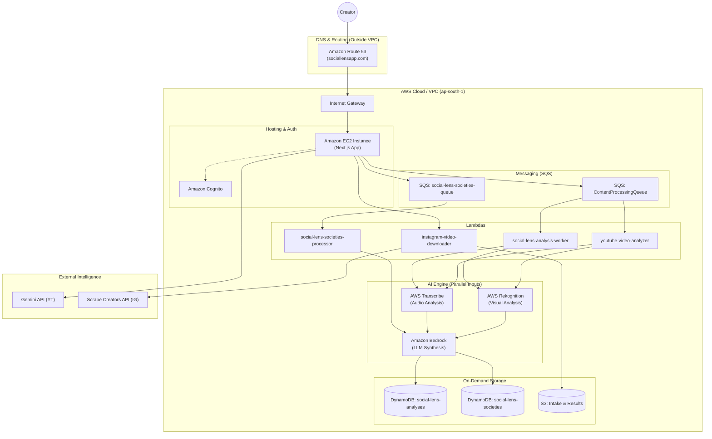

# Design Document: Social Lens

## Overview

Social Lens is a cloud-native platform built on a hybrid architecture of AWS EC2 and serverless AI services. Hosted at **sociallensapp.com** in the `ap-south-1` (Mumbai) region, the system provides comprehensive multimodal analysis of short-form video content with a "Bharat-First" approach.

The core innovation lies in the "DNA Vector Synthesis" methodology, where content is decomposed into fundamental visual, audio, and cultural elements using AWS AI services and synthesized into a comprehensive profile using **Amazon Bedrock (NovaPro)**.

## Architecture

### High-Level Architecture (Golden Version)


```mermaid
graph TB
    subgraph External_DNS ["DNS & Routing (Outside VPC)"]
        R53["Amazon Route 53<br/>(sociallensapp.com)"]
    end

    subgraph VPC ["AWS Cloud / VPC (ap-south-1)"]
        IGW["Internet Gateway"]
        
        subgraph Web ["Hosting & Auth"]
            EC2["Amazon EC2 Instance<br/>(Next.js App)"]
            Cognito["Amazon Cognito"]
        end

        subgraph Queues ["Messaging (SQS)"]
            SQS_Main["SQS: ContentProcessingQueue"]
            SQS_Soc["SQS: social-lens-societies-queue"]
        end

        subgraph Workers ["Lambdas"]
            L_YT["youtube-video-analyzer"]
            L_Worker["social-lens-analysis-worker"]
            L_Soc["social-lens-societies-processor"]
            L_IG["instagram-video-downloader"]
        end

        subgraph AI_Intelligence ["AI Engine (Parallel Inputs)"]
            Rek["AWS Rekognition<br/>(Visual Analysis)"]
            Trans["AWS Transcribe<br/>(Audio Analysis)"]
            Bedrock["Amazon Bedrock<br/>(LLM Synthesis)"]
        end

        subgraph Storage ["On-Demand Storage"]
            DB_Analyses[("DynamoDB: social-lens-analyses")]
            DB_Soc[("DynamoDB: social-lens-societies")]
            S3[("S3: Intake & Results")]
        end
    end

    subgraph External_APIs ["External Intelligence"]
        Gemini["Gemini API (YT)"]
        Scrape["Scrape Creators API (IG)"]
    end

    User((Creator)) --> R53 --> IGW --> EC2
    EC2 -.-> Cognito
    
    EC2 --> Gemini
    EC2 --> SQS_Main & SQS_Soc & L_IG
    
    SQS_Main --> L_YT & L_Worker
    SQS_Soc --> L_Soc
    L_IG --> Scrape
    
    %% Parallel Analysis
    L_YT & L_Worker --> Rek & Trans
    Rek --> Bedrock
    Trans --> Bedrock
    L_Soc --> Bedrock
    
    Bedrock --> DB_Analyses & DB_Soc
    L_IG --> S3
```

### Infrastructure Components

**Amazon Route 53**: Handles DNS for `sociallensapp.com`, routing traffic to the EC2 instance.

**Amazon EC2**: A persistent instance running the Next.js production server, handling the frontend, API routes, and user sessions.

**Amazon Cognito**: Manages user authentication and secure access to the platform.

**AWS Lambda**:
- `youtube-video-analyzer`: Triggered by SQS for YT-specific processing.
- `instagram-video-downloader`: Directly invoked to fetch IG content via Scrape Creators.
- `social-lens-analysis-worker`: Main multimodal analysis orchestrator.
- `social-lens-societies-processor`: Runs generational simulations via Bedrock.

**S3 Storage**:
- `social-lens-intake`: Temporary storage for raw video/audio assets.
- `reel-dna-results`: Persistent storage for analysis reports and generated heatmaps.

**SQS Queues**:
- `ContentProcessingQueue`: Standard queue for main analysis tasks.
- `social-lens-societies-queue`: Dedicated queue for high-latency multi-agent simulations.

## Components and Interfaces

### 1. URL Intake & Hosting (Next.js on EC2)

**Interface**: Next.js API routes (App Router) handling URL submissions.

```typescript
interface AnalysisJob {
  userId: string;
  jobId: string;    // DynamoDB Sort Key
  url: string;
  platform: 'youtube' | 'instagram';
  status: 'QUEUED' | 'PROCESSING' | 'COMPLETED';
}
```

**Responsibilities**:
- Validate URLs from YouTube/Instagram.
- Authenticate requests via Amazon Cognito.
- Push jobs to SQS for asynchronous processing.
- Provide real-time status tracking via polling.

### 2. Multi-Agent Societal Simulator (Bedrock NovaPro)

**Philosophy**: Instead of static filters, Social Lens uses a "Digital Society" of AI agents.

**Implementation**:
- **Generational Agents**: GenZ (Focus: Virality/Slang), Millennials (Focus: Relatability), Boomers (Focus: Values).
- **Simulation Flow**: Content DNA is passed to Bedrock agents to generate a simulated "comment thread" and sentiment scores.

### 3. Multimodal Engine (Parallel Pipeline)

**Engine Orchestration**:
- **Visual**: AWS Rekognition for object/scene/emotion detection.
- **Audio**: AWS Transcribe with specialized Indian English/Hindi models.
- **Synthesis**: Inputs are combined in `social-lens-analysis-worker` and passed to **Bedrock NovaPro** for DNA synthesis.

## Data Models

### Core Data Structures

```typescript
// Primary analysis result
interface AnalysisResult {
  analysisId: string;
  userId: string;
  videoMetadata: VideoMetadata;
  contentDNA: ContentDNA;
  societalAudit: SocietalAudit;
  retentionHeatmap: RetentionHeatmap;
  processingTime: number;
  createdAt: Date;
}

// Video metadata
interface VideoMetadata {
  url: string;
  platform: 'instagram' | 'youtube' | 'other';
  duration: number;
  resolution: Resolution;
  fileSize: number;
  format: string;
}

// Cultural context markers
interface CulturalElement {
  type: 'festival' | 'tradition' | 'symbol' | 'language' | 'music';
  name: string;
  confidence: number;
  region?: string;
  significance: string;
  timestamp?: number;
}

// Hinglish detection results
interface CodeSwitchingEvent {
  startTime: number;
  endTime: number;
  hindiText: string;
  englishText: string;
  switchType: 'intra-sentential' | 'inter-sentential' | 'tag-switching';
  naturalness: number; // 0-100
}
```

### Storage Schema

**DynamoDB Tables**:
- **social-lens-analyses**: Stores results (Partition Key: `userId`, Sort Key: `jobId`).
- **social-lens-societies**: Stores simulation data (Partition Key: `userId`, Sort Key: `jobId`).

**S3 Bucket Structure**:
```
s3://social-lens-intake/
  └── {jobId}/
      ├── video.mp4
      └── audio.wav
s3://reel-dna-results/
  └── {userId}/{jobId}/
      ├── dna_report.json
      └── society_simulation.json
```

## Correctness Properties

*A property is a characteristic or behavior that should hold true across all valid executions of a system—essentially, a formal statement about what the system should do. Properties serve as the bridge between human-readable specifications and machine-ve### Property 1: Content Ingestion Completeness
*For any* valid YouTube or Instagram URL submitted to the system via the EC2 frontend, the system should successfully extract media via Gemini/Scrape Creators, upload to S3, and trigger the `ContentProcessingQueue`.

### Property 2: Multi-Agent Simulation Integrity
*For any* Content DNA synthesized, the `social-lens-societies-processor` should successfully generate a multi-generational simulation (GenZ, Millennial, Boomer) and store it in the `social-lens-societies` table.

### Property 3: Parallel Analysis Flow
*For any* ingestion event, the analysis worker should trigger Rekognition and Transcribe in parallel, ensuring that slow audio transcribing doesn't block visual analysis.

## Error Handling

### Error Classification and Response Strategy

**Scraping & API Errors**:
- Scrape Creators API failures: Log and notify user to retry.
- Gemini API quota issues: Fall back to basic metadata extraction when possible.

**AWS Lambda & SQS Issues**:
- SQS Visibility Timeout reaching limit: Handle as incomplete analysis and flag for manual review.
- Rekognition/Transcribe throttling: Implement exponential backoff in Lambda handlers.

## Testing Strategy

### Integration Testing Focus
- **End-to-End URL Flow**: From Next.js frontend to DynamoDB storage.
- **DNA Synthesis Accuracy**: Verifying that `NovaPro` correctly combines visual and audio tags.
- **Simulation Logic**: Ensuring the three generational agents consistently produce distinct, culturally-aware personas.
sting to catch production issues early